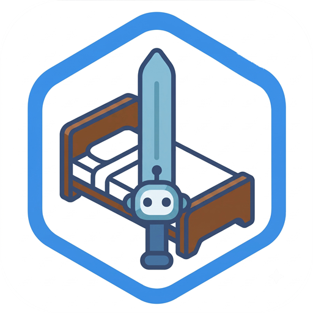

<div align="center">
  
  <h1>Botting</h1>
  <p>A Windows desktop tool for Minecraft accounts, bot sessions, and Hypixel matchmaking.</p>
  <p><a href="README.md">繁體中文</a> · <a href="README.en.md">English</a></p>
  <p><a href="LICENSE">AGPL-3.0-only</a> · <a href="CONTRIBUTING.md">Contributing</a></p>
</div>

## Overview

Botting brings login, per-account server addresses, bot lifecycle control, player-log matching, and session logs into one desktop application.

- Microsoft device-code login, Minecraft access tokens, and Cookie imports.
- Individual and batch bot control with a dedicated session and thread per bot.
- BedWars, Duels, and SkyWars matching with mode-specific queue, chat, real-name, or pitch verification.
- Nick Roller with text and length rules, manual decisions, automatic acceptance, and server confirmation. Nick Roller and matchmaking are mutually exclusive.
- Global shortcuts, a floating overlay, themes, Traditional Chinese and English, and log export.
- Windows DPAPI-encrypted account and settings storage in the current user's Registry.

## License

Project-owned source is licensed under **GNU AGPL version 3 only (`AGPL-3.0-only`)**. Read the complete [LICENSE](LICENSE).

When distributing this program or a covered derivative or combined work, preserve the notices and provide complete Corresponding Source under the applicable AGPL terms, including required build and installation materials. If you modify the program and let users interact with that version remotely over a computer network, section 13 requires a prominent opportunity for those users to receive its Corresponding Source.

Covered derivatives cannot be relicensed as proprietary software. Merely running or reading the code does not require disclosure of every independent program, private data, or unrelated work. Third-party dependencies and assets retain their own licenses; see [THIRD_PARTY_NOTICES.md](THIRD_PARTY_NOTICES.md).

## Architecture

```text
apps/shared-ui/                         Shared components, motion, and scaling
apps/user-desktop/src/App.svelte        Page and dialog composition
apps/user-desktop/src/lib/adapters/     Tauri IPC and native window APIs
apps/user-desktop/src/lib/features/     State coordination and input parsing
apps/user-desktop/src/lib/components/   Feature-oriented UI components
apps/user-desktop/src/lib/models/       Wire contracts
apps/user-desktop/src/lib/log/          Log formatting and transitions
apps/user-desktop/src-tauri/src/
  commands/                            Thin IPC entry points
  runtime/                             Application and account services
  bot_runtime/                         Azalea sessions, AFK, and Nick state machine
  matchmaking/                         Plans, log tailing, detection, and retries
  auth/                                Microsoft and Minecraft authentication
  platform/                            Windows keyboard hooks
crates/local-store/                     DPAPI and Registry persistence
docs/                                  Reviews and coding conventions
scripts/                               Public-release preflight
.github/                               Issue/PR templates and manual preflight
```

The frontend uses Svelte 5, TypeScript 5, and Vite 8. Tauri 2 hosts the application; Rust, Azalea, Tokio, and Bevy ECS manage bot sessions. See the [main README](README.md#專案架構) for the architecture diagram and [coding conventions](docs/code-conventions.md) for naming and ownership boundaries.

## Getting Started

Use Windows 10/11, Node 22 LTS (22.16 or newer), pnpm 11.9.0, Visual Studio 2022 C++ Build Tools with Windows SDK, and WebView2 Runtime. Rust is pinned to `nightly-2026-08-04`; stable Rust does not support the workspace's Cargo profile options. See [Tauri's Windows prerequisites](https://v2.tauri.app/start/prerequisites/#windows).

```powershell
git clone https://github.com/dibai111/Boosting-Bot.git
cd Boosting-Bot
npm install --global pnpm@11.9.0
rustup toolchain install nightly-2026-08-04 --profile minimal --component rustfmt --component clippy
pnpm install --frozen-lockfile
pnpm tauri:dev
```

The repository is currently private, so cloning requires authorized GitHub access. Adding a license does not change repository visibility.

`pnpm tauri:dev` starts Vite at `http://localhost:1420` and opens the desktop application. `pnpm dev` runs only Vite; account and bot operations require Tauri IPC. Both Vite and Tauri must agree on the development port.

No application environment variables or `.env` file are required. Tauri supplies `TAURI_ENV_PLATFORM` for the frontend target. Do not put credentials in the `VITE_` or `TAURI_` variables exposed to frontend code.

Accounts and preferences are stored as DPAPI-encrypted JSON in `HKEY_CURRENT_USER\Software\BoostingBot`, value `State`. The historical path remains for compatibility. Logs export to Downloads by default.

```powershell
pnpm check
pnpm build
cargo check --workspace --locked
pnpm tauri:build
```

Bundling is disabled (`bundle.active: false`). Desktop builds produce `target/release/botting-user.exe`, not an MSI or NSIS installer. Distribution requires the appropriate license and source materials.

## Usage

1. Add a Microsoft account in Accounts, supply a server such as `mc.hypixel.net`, and complete device-code login.
2. Select it in Bots and start it. Wait for Online before using game features.
3. For matchmaking, select up to 32 online bots, a mode, minimum match count, and the player's `latest.log`. Start matching before joining a new game: previous log content is not replayed.
4. For Nick Roller, stop matchmaking first. Select online Hypixel bots with MVP++ Nick permissions and set Hypixel's language to English. Configure rules, then accept, skip, or automatically apply candidates.
5. Inspect or export session logs and stop bots when finished.

The default launcher log is usually `%APPDATA%\.minecraft\logs\latest.log`; other launchers use their instance directory. BedWars can verify chat presence, Duels can verify pitch gestures, and SkyWars checks real names. `F8` toggles matching and `F9` toggles its overlay; both are configurable.

Nick priority rules may accept candidates before ordinary restrictions. Exact length cannot be combined with minimum/maximum length. Applied names are checked against the server's confirmation book.

## Contributing

Read [CONTRIBUTING.md](CONTRIBUTING.md), use the Issue templates, and describe the behavior change and checks performed. Reuse existing tests and avoid unnecessary unit tests, mocks, or test scripts for comments, formatting, or small reversible changes.

Known limitations are recorded in [docs/open-source-review.md](docs/open-source-review.md). Run `pnpm release:check` before a public release. The preflight reads repository visibility and rejects private repositories; it does not publish code, change visibility, or create releases.
