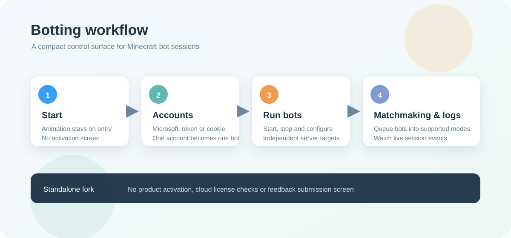

<p align="center">
  
</p>

<h1 align="center">Botting</h1>

<p align="center">一個以桌面介面管理 Minecraft bot 工作階段的輕量工具。</p>

<p align="center">
  
</p>

## 這個專案是什麼

Botting 是原本 user software 的獨立副本，集中處理 Minecraft 帳號、bot 啟停、伺服器地址、配對流程和工作階段記錄。它適合用來快速啟動及管理多個 bot，並在同一個介面查看目前狀態和錯誤。

這個副本的啟動流程已經簡化：保留原有啟動 animation，但啟動後會直接進入主介面，不會顯示產品啟用頁面，也不會連接原本的 Control Plane。

## 主要功能

- **帳號管理**：使用 Microsoft、Access Token 或 Cookie 新增 Minecraft 帳號。
- **Bot 控制**：逐個或批量啟動、停止 bot，並為每個帳號保存獨立伺服器地址。
- **配對工作階段**：支援 BedWars、Duels 和 SkyWars 的配對流程。
- **即時記錄**：查看 bot 狀態、聊天記錄、配對進度和 session log。
- **桌面操作**：快捷鍵、浮動配對 overlay、主題切換和記錄匯出。
- **啟動體驗**：保留品牌啟動 animation，完成載入後直接展開到主工作區。

## 專案結構

```text
Botting/
├─ apps/
│  ├─ shared-ui/          共用動畫、視窗和 UI 工具
│  └─ user-desktop/       Svelte + Tauri desktop app
├─ crates/
│  └─ local-store/        本地帳號和設定儲存
├─ docs/assets/           README 圖片資產
├─ Cargo.toml             最小 Rust workspace
└─ package.json           pnpm 指令入口
```

## 開始使用

需求：Windows、Node.js、pnpm、Rust toolchain，以及 Tauri 所需的 WebView2／Windows 開發工具。

```powershell
cd D:\Codex\Botting
pnpm install
pnpm tauri:dev
```

只檢查前端：

```powershell
pnpm check
pnpm build
```

檢查 Rust workspace：

```powershell
cargo check --workspace
```

建立 desktop package：

```powershell
pnpm tauri:build
```

## 使用流程

1. 啟動 Botting，等待啟動 animation 完成。
2. 開啟 **Accounts**，新增 Microsoft 帳號或匯入 token／cookie。
3. 在 **Bots** 設定各帳號的伺服器地址，選擇要啟動的 bot。
4. 在 **Matchmaking** 選擇遊戲模式和配對數量。
5. 在 **Sessions** 查看即時狀態和匯出記錄。

請只使用你有權使用的 Minecraft 帳號和伺服器，並遵守相關服務的規則。

## 與原始專案的關係

原始 repo 位於 `D:\Codex\Boosting Bot`。本資料夾是獨立副本，修改只會影響 `D:\Codex\Botting`，不會回寫原始 user software。
