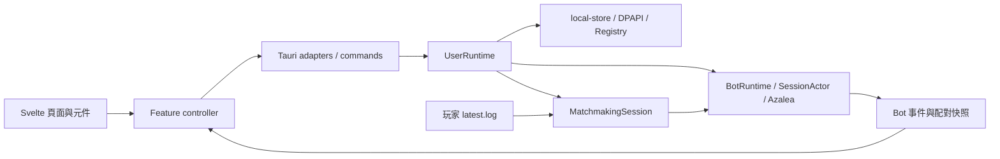

<div align="center">
  
  <h1>Botting</h1>
  <p>集中管理 Minecraft 帳號、Bot 連線與 Hypixel 配對流程的 Windows 桌面工具。</p>
  <p><a href="README.md">繁體中文</a> · <a href="README.en.md">English</a></p>
  <p><a href="LICENSE">AGPL-3.0-only</a> · <a href="CONTRIBUTING.md">參與貢獻</a></p>
</div>

## 專案簡介

同時操作多個 Minecraft 帳號時，登入、伺服器地址、Bot 狀態與玩家日誌往往分散在不同視窗。Botting 將這些工作集中在同一個桌面介面，提供獨立連線控制、配對進度及可匯出的工作階段記錄。

- **帳號管理**：Microsoft 裝置代碼登入、Minecraft access token 及 Cookie 匯入；各帳號保存獨立伺服器地址。
- **Bot 控制**：單個或批次啟停，顯示登入、連線與離線進度；每個 Bot 有自己的執行緒及工作階段。
- **Hypixel 配對**：支援 BedWars、Duels、SkyWars，追蹤玩家 `latest.log`，依模式使用佇列、聊天、真實名稱或俯仰手勢確認。
- **Nick Roller**：依長度、字元、允許清單及文字條件篩選暱稱，支援人工決策、自動套用與服務端確認；與配對模式互斥。
- **桌面整合**：全域快捷鍵、置頂浮動視窗、繁體中文／英文、明暗主題與日誌匯出。
- **本機儲存**：帳號及設定以 Windows DPAPI 加密後存入目前使用者的 Registry，帳號查詢不回傳登入憑據。

目前支援 Windows，會連線至 Microsoft、Minecraft、Hypixel 及皮膚圖片服務。

## 授權與 Copyleft

本專案自有原始碼採用 **GNU Affero General Public License v3.0 only（AGPL-3.0-only）**，完整英文條款見 [LICENSE](LICENSE)。這是包含網路互動原始碼義務的強 Copyleft 授權。

**使用或參考本專案原始碼形成受授權涵蓋的衍生作品，並散布該作品，或修改後讓使用者透過網路與其互動時，必須依 AGPLv3 提供完整對應原始碼並保留相同授權義務。不得將受涵蓋的衍生作品改為封閉原始碼。**

| 情境                                       | 要求                                                                                                    |
| ------------------------------------------ | ------------------------------------------------------------------------------------------------------- |
| 散布本程式、修改版或受涵蓋的組合作品       | 保留版權與授權聲明，依條款提供完整對應原始碼及必要建置／安裝資料；適用時提供 Installation Information。 |
| 修改程式後讓使用者透過電腦網路互動         | 依第 13 條向這些使用者提供取得該版本完整對應原始碼的明顯機會。                                          |
| 單純執行、閱讀，或未觸發上述義務的私人修改 | 不會因此要求公開所有私人程式、資料或獨立作品。                                                          |
| 僅借鑑想法，沒有複製受保護的程式表達       | 不能一概視為受 AGPL 涵蓋的衍生作品。                                                                    |
| 獨立第三方套件與素材                       | 繼續適用各自授權；專案 Header 不取代其條款。                                                            |

「使用或參考就必須把所有作品全部公開」不是 GPL／AGPL 的精確法律效果。上表說明實際觸發條件，以 LICENSE 正文為準。第三方來源見 [THIRD_PARTY_NOTICES.md](THIRD_PARTY_NOTICES.md)。

## 專案架構

```text
Botting/
├─ apps/
│  ├─ shared-ui/                  共用元件、動畫與畫布縮放
│  └─ user-desktop/
│     ├─ src/
│     │  ├─ App.svelte             頁面、表單及對話框組裝
│     │  └─ lib/
│     │     ├─ adapters/           Tauri IPC 與原生視窗入口
│     │     ├─ components/         帳號、Bot、配對及 Nick 元件
│     │     ├─ features/           狀態協調、設定解析與事件投影
│     │     ├─ log/                日誌整理及匯出格式
│     │     └─ models/             前後端傳輸型別
│     ├─ src-tauri/src/
│     │  ├─ commands/             薄層 Tauri 命令入口
│     │  ├─ runtime/              登入、儲存與工作模式協調
│     │  ├─ bot_runtime/          Azalea 連線、actor、AFK 與 Nick
│     │  ├─ matchmaking/          配對計畫、日誌追蹤、偵測與重試
│     │  ├─ auth/                 Microsoft／Minecraft 登入交換
│     │  └─ platform/             Windows 快捷鍵 hook
│     └─ tests/                   既有前端行為測試
├─ crates/local-store/            DPAPI／Registry 儲存及版本模型
├─ docs/                         命名慣例與圖片
├─ .github/                      Issue／PR 範本
├─ Cargo.toml                    Rust workspace
└─ package.json                  pnpm 指令入口
```



前端使用 Svelte 5、TypeScript 5、Vite 8；桌面宿主為 Tauri 2，連線與排程使用 Rust、Azalea、Tokio 及 Bevy ECS。Rust 使用 `snake_case`，TypeScript 函式使用 `camelCase`，IPC 欄位沿用 Rust 契約，詳見 [程式碼慣例](docs/code-conventions.md)。

## 快速開始

### 環境需求

| 依賴     | 要求                                                                            |
| -------- | ------------------------------------------------------------------------------- |
| 系統     | Windows 10／11；本機儲存與全域快捷鍵依賴 Windows API。                          |
| Node.js  | 建議 Node 22 LTS，至少 22.16；既有測試使用 Node TypeScript 型別移除功能。       |
| pnpm     | `11.9.0`，與 `packageManager` 一致。                                            |
| Rust     | `nightly-2026-08-04`，由 `rust-toolchain.toml` 固定，包含 rustfmt、Clippy。     |
| 原生工具 | Visual Studio 2022 Build Tools 的 Desktop development with C++ 與 Windows SDK。 |
| WebView  | Microsoft Edge WebView2 Runtime。                                               |
| 遊戲     | 具 Minecraft Java Edition 使用資格的帳號；Hypixel 功能需可連線至該服務。        |

Rust nightly 為必要條件，workspace 使用不穩定的 Cargo profile 選項。原生依賴見 [Tauri Windows 環境設定](https://v2.tauri.app/start/prerequisites/#windows)。

### 安裝與啟動

```powershell
git clone https://github.com/dibai111/Boosting-Bot.git
cd Boosting-Bot
npm install --global pnpm@11.9.0
rustup toolchain install nightly-2026-08-04 --profile minimal --component rustfmt --component clippy
pnpm install --frozen-lockfile
pnpm tauri:dev
```

倉庫目前仍為私有，複製時需要已獲授權的 GitHub 登入。加入授權文件不會改變 GitHub 可見性。

`pnpm tauri:dev` 同時啟動 Vite 與桌面程式，開發端點為 `http://localhost:1420`。該連接埠需可用；修改時須同步 `vite.config.ts` 與 `tauri.conf.json`。

`pnpm dev` 只啟動前端開發伺服器；帳號、儲存及 Bot 操作需要 Tauri IPC，日常開發應使用 `pnpm tauri:dev`。

### 環境變數與資料位置

目前**沒有必填的應用環境變數**，不需要建立 `.env` 或填寫伺服器 API key。Microsoft 登入使用裝置代碼流程。`TAURI_ENV_PLATFORM` 由 Tauri CLI 提供，用來選擇建置目標；Vite 的 `VITE_`／`TAURI_` 前綴可被打包進前端，不適合放登入憑據。

帳號與設定存於 `HKEY_CURRENT_USER\Software\BoostingBot` 的 `State` 值，內容為 DPAPI 加密的 JSON。保留歷史 Registry 名稱以相容既有資料。日誌匯出目錄可於 Settings 修改，預設為 Downloads。

### 建置與檢查

```powershell
pnpm check
pnpm build
cargo check --workspace --locked
pnpm tauri:build
```

目前 `bundle.active` 為 `false`，桌面執行檔位於 `target/release/botting-user.exe`，**不會產生 MSI／NSIS 安裝包**。散布安裝包需另行設定 bundler，並隨二進位提供授權與對應原始碼。

## 使用範例

### 最小可行流程

1. 執行 `pnpm tauri:dev`，在 Accounts 新增 Microsoft 帳號，填入伺服器地址，例如 `mc.hypixel.net`。
2. 按畫面提供的網址完成 Microsoft 裝置代碼登入。
3. 在 Bots 選取帳號並啟動，等待 Online。
4. 在 Sessions 查看記錄，結束時停止所選 Bot。

### 配對至玩家所在場次

啟動玩家自己的 Minecraft，取得該實例的 `latest.log` 完整路徑。預設啟動器通常為 `%APPDATA%\.minecraft\logs\latest.log`，其他啟動器使用各自的實例目錄。

在 Matchmaking 選擇線上 Bot、遊戲模式、最低配對數、驗證選項及日誌路徑。**先啟動配對，再讓玩家進入新場次**：追蹤器從當下日誌尾端開始，不重播舊轉服記錄。每次配對最多選取 32 個 Bot。

BedWars 可使用聊天在場確認，Duels 可使用俯仰手勢確認，SkyWars 使用日誌中的真實名稱。預設 `F8` 切換配對啟停，`F9` 切換浮動視窗，可在 Settings 修改。

### 篩選 Hypixel 暱稱

停止配對後，在 Nick Roller 選取線上的 Hypixel Bot。帳號需要 **MVP++ Nick 權限**，Hypixel 語言須為英文，書本及聊天解析使用英文標記。

設定最大長度或文字條件後開始。精確長度不能與最小／最大長度同時啟用；優先規則及允許清單可先於一般限制接受候選。可人工接受／跳過，或開啟找到後自動套用；套用後會讀取確認書本核對名稱。

## 參與貢獻

透過 [Issues](https://github.com/dibai111/Boosting-Bot/issues) 回報可重現問題或功能需求。提交前閱讀 [CONTRIBUTING.md](CONTRIBUTING.md)，說明問題、行為變化與實際驗證結果。

使用既有檢查與測試，不要為註解、排版或可逆的小改動新增測試、Mock 或測試腳本。
